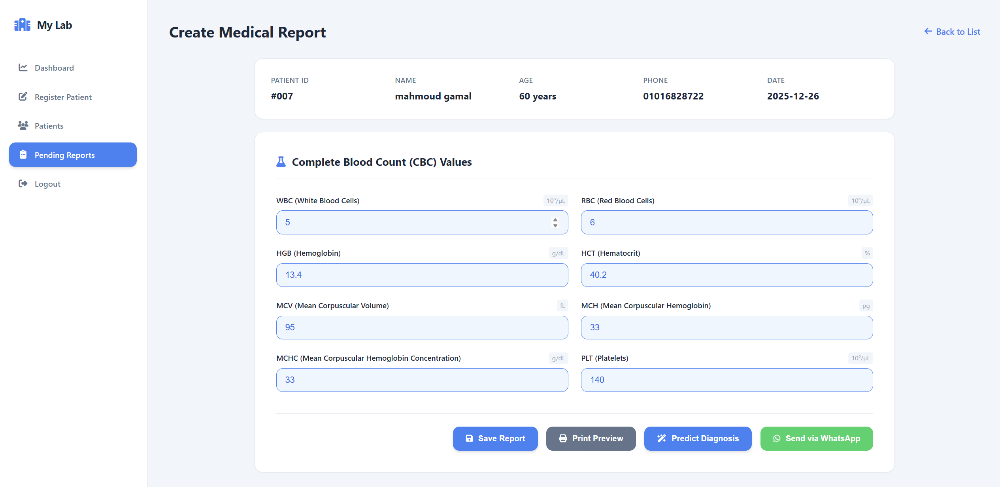
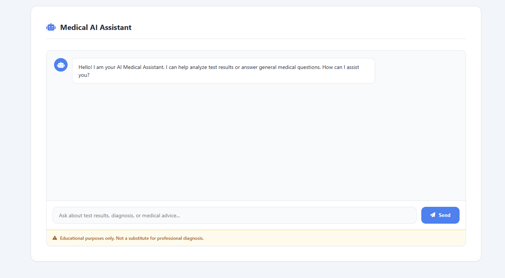
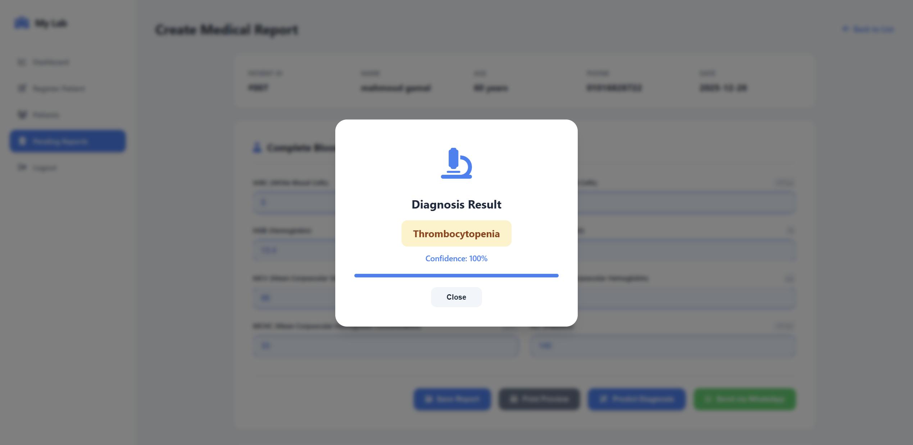

# 🩸 HemaSense System

An intelligent CBC analysis system using Machine Learning and Medical LLM
to predict anemia levels and generate smart medical reports.

---

##  System Overview

---

##  Medical LLM Module

---

##  Machine Learning Model

## Team members :
- Mohammed Abdel-Samie
- Yahia Mahmoud Farouk
- Mahmoud Ahmed Abd El-Hameed
- Anwar Ayman Anwar 

## 1. Introduction

### 1.1 Purpose
The purpose of the **Laboratory Management System** is to streamline the operations of a medical laboratory. It provides a centralized platform for **managing patient records**, **financial transactions**, and **generating detailed medical reports** with **AI-assisted diagnosis**. The system distinguishes between administrative roles (**Secretary**) and medical roles (**Doctor**) to ensure data security and operational efficiency.

### 1.2 Intended Audience and Reading Suggestions
- **Project Stakeholders:** To understand the project scope and deliverables.
- **Developers:** To understand the system architecture, API endpoints, and database schema for maintenance and future expansion.
- **Project Managers:** to plan, track, and manage development phases.
- **End Users (Doctors and Secretaries):** To understand the system features and how to use them effectively.
- **Testers:** To derive test cases from the specified requirements and use case scenarios.

###  1.3 Product Scope
The Laboratory Management System aims to streamline the entire workflow of a patient visit to the laboratory. It provides doctors and secretaries with efficient tools to handle patient registration, sample analysis, diagnosis, and reporting.

##### The system offers:

- **Registration:** Easy entry of patient demographics and payment processing.
    
- **Sample Analysis:** Recording and managing CBC (Complete Blood Count) test results.
    
- **Diagnosis:** AI-powered suggestions using a Decision Tree model based on test results.
    
- **Reporting:** Generating clear, printable medical reports for patients and doctors.
    
- **AI chat assistant:**  for answering medical queries and guiding users through lab procedures.
    

The system ensures accuracy, speed, and ease of use, helping medical staff deliver timely and informed decisions.

## 2. Overall Description

### 2.1 Product Perspective
**"Laboratory Management System"** is a web-based application built with a modern technology stack:
-   **Frontend:** HTML, CSS, JavaScript (Vanilla).
-   **Backend:** FastAPI (Python) 
-   **Database:** MySQL for robust data storage.
-   **AI Integration:** Scikit-learn for ML model (Decision Tree) and Transformers for LLM-based chat 
**("SciReason-LFM2-2.6B")** model

### 2.2 Product Functions
-   **User Authentication:** Secure login for Doctors and Secretaries with role-based access control.
-   **Patient Management:** Register, update, search, and delete patient records.
-   **Report Generation:** Input CBC test parameters (WBC, RBC, HGB, etc.) and save reports.
-   **AI Assistance:**
    -   **Predictive Diagnosis:** Auto-suggest diagnosis based on CBC values.
    -   **AI Chat:** Conversational interface for medical assistance.
-   **Dashboard:** Visual Latest Registered Patients, total patients
- **Offline access** : local system 

### 2.3 User Classes and Characteristics
1.  **Secretary:**
    -   **Responsibilities:** Patient registration, managing patient data.
    -   **Access:** Dashboard, Patient Management, Registration. Does NOT have access to medical reports or diagnosis tools.
2.  **Doctor:**
    -   **Responsibilities:** Analyzing samples, creating reports, diagnosing conditions, printing reports.
    -   **Access:** Full access including Dashboard, Patient Management, Pending Reports, Report Creation, and AI Tools.

### 2.4 Operating Environment
### Hardware:
- **Desktops** (windows or Mac OS)
- **5.89 GB** free storage

### Software:
-   **Client:** Modern web browser (Chrome, Edge, Firefox).
-   **Server:** Python environment (3.8+) capable of running FastAPI/Uvicorn.
-   **Database:** MySQL server local .

### 2.5 Design and Implementation Constraints
-   **Stateless Backend:** The API uses session-based authentication but follows REST principles.
-   **Security:** Passwords currently stored in plain text (demonstration purpose).
- The system must function offline.
- The interface must be user-friendly, with clear visuals and step-by-step guides.

### 2.6 Assumptions and Dependencies
-   The "DecisionTree.pkl" model file must be present for prediction features to work.
-   The "SciReason-LFM2-2.6B" model file must be present for prediction features to work.
-   The system depends on MySQL for offline data and optional internet connection for
updates.

## 3. Non-Functional Requirements
| **Attribute**       | **Description**                                                                                                                          |
| :------------------ | :--------------------------------------------------------------------------------------------------------------------------------------- |
| **Usability**       | Simple, modern interface with clear navigation and intuitive icons. Features like "Print Preview" and "AI Chat" enhance user experience. |
| **Reliability**     | Built on FastAPI with Pydantic data validation to ensure stability and prevent errors.                                                   |
| **Availability**    | Available 24/7 as long as the host server is running.                                                                                    |
| **Portability**     | Web-based application accessible from any device with a browser within the network.                                                      |
| **Maintainability** | Modular code structure separating frontend templates, static assets, database logic, and API routes (main.py).                           |
| **Security**        | Role-Based Access Control (RBAC) restricts sensitive features to authorized doctors. API endpoints verify user sessions.                 |

### 4.2 Use Case Scenarios

| **Use case Name**   | Patient Registration                                                                                                                                                                                                                                                        |
| :------------------ | :-------------------------------------------------------------------------------------------------------------------------------------------------------------------------------------------------------------------------------------------------------------------------- |
| **Goal**            | Add new patient in our clinic                                                                                                                                                                                                                                               |
| **primary Actor**   | Secretary                                                                                                                                                                                                                                                                   |
| **Secondary Actor** | Doctor                                                                                                                                                                                                                                                                      |
| **Pre condition**   | patient should not exist                                                                                                                                                                                                                                                    |
| **post condition**  | patient information get into to database and adding payment                                                                                                                                                                                                                 |
| **Trigger**         |                                                                                                                                                                                                                                                                             |
| **Main Flow**       | 1.  Secretary logs in and navigates to "Register Patient". 2.  Secretary enters Patient Name, Age, Phone, and Total Payment amount. 3.  System saves the patient and initializes and make payment 4.  System redirects to the Patients list showing the new entry. |

| **Use case Name**   | Creating a Medical Report                                                                                                                                                                                                                                                                                                                                                                                                                                                                                                                   |
| :------------------ | :------------------------------------------------------------------------------------------------------------------------------------------------------------------------------------------------------------------------------------------------------------------------------------------------------------------------------------------------------------------------------------------------------------------------------------------------------------------------------------------------------------------------------------------ |
| **Goal**            | create a CBC report for the patient                                                                                                                                                                                                                                                                                                                                                                                                                                                                                                         |
| **primary Actor**   | Doctor                                                                                                                                                                                                                                                                                                                                                                                                                                                                                                                                      |
| **Secondary Actor** |                                                                                                                                                                                                                                                                                                                                                                                                                                                                                                                                             |
| **Pre condition**   | patient registration                                                                                                                                                                                                                                                                                                                                                                                                                                                                                                                        |
| **post condition**  | save CBC values to database and predict Animia diagnosis from machine learning model and print report                                                                                                                                                                                                                                                                                                                                                                                                                                       |
| **Trigger**         |                                                                                                                                                                                                                                                                                                                                                                                                                                                                                                                                             |
| **Main Flow**       | 1.  Doctor logs in and sees a "Pending Reports" count. 2.  Doctor navigates to "Pending Reports" and selects a patient. 3.  Doctor enters CBC values (WBC, RBC, HGB, etc.). 4.  Doctor clicks "Predict Diagnosis". 5.  System uses the Decision Tree model to analyze values and suggests a diagnosis (e.g., "Iron Deficiency Anemia"). 6.  Doctor reviews, confirms, and clicks "Save Report". 7.  System saves the report  8. Generate PDF preview and can print it 9. removes the patient from the pending list. |

